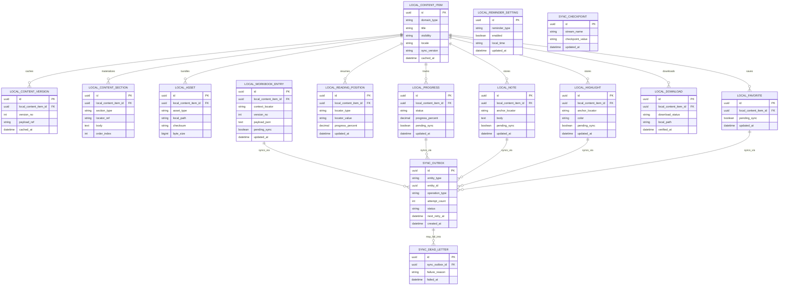

# PST Content Platform ERD

## Scope

This ERD turns the recommended target architecture into a concrete data model for:
- the 5 primary source truth libraries
- the 4 user-facing Discovery content types
- editorial publishing and source ingestion
- subscriptions and entitlements
- reading, progress, notes, favorites, and downloads
- coach, group, club, gamification, AI/RAG, notifications, and video
- mobile offline caching and sync

It is designed to extend the current domain model in `artifacts/domain/domain_model.json`, not replace it blindly.

## Reading Guide

- `Diagram 1` models the editorial, publishing, and content composition core.
- `Diagram 2` models operational app data and future epics.
- `Diagram 3` models the mobile offline database and sync layer.
- Some low-value join tables are omitted from the diagrams when the relationship is obvious from the surrounding entities.

## Discovery and Source Truth Rules

- `Journey` is a user-facing content type and may contain `Module`, `Workshop`, and `Ebook`
- `Workshop` is a user-facing content type and wraps only `Workshop`
- `Module` is a user-facing content type built from `SpiritualLesson` or `EmotionEntry`
- `Ebook` is a user-facing content type and wraps only `Ebook`
- `HadithAnalysis` is modeled as a source truth library and is linked into journeys, modules, and workshops through `CONTENT_RELATION` unless a dedicated Discovery type is added later

## Source Document Modeling Rules

- `SOURCE_DOCUMENT.source_type` should stay limited to `markdown`, `rich_text_json`, `html`, `plain_text`, `docx`, `epub`, and `audio_transcript`
- `SOURCE_DOCUMENT.source_type` should default to `rich_text_json` for newly created editor-authored source records
- editor-authored `rich_text_json` should live in `SOURCE_DOCUMENT.payload_json` as Postgres `jsonb`
- `SOURCE_DOCUMENT.original_uri` should stay optional so imported files and exported snapshots can coexist with in-database source payloads
- Raw intake formats such as `docx`, `epub`, and editor JSON should be preserved, but AI retrieval should run against normalized published text rather than the raw source file
- `audio_transcript` documents should preserve timestamp locators so AI citations can point back to exact media segments
- The publishing pipeline should normalize every source document into canonical blocks before chunking, embedding, and citation tracing
- the reader and RAG pipeline should consume the published payload referenced by `CONTENT_VERSION.structured_payload_ref`, not the raw `SOURCE_DOCUMENT.payload_json`

## Diagram 1: Content, Source, Publishing, and Composition

```mermaid
erDiagram
    SOURCE_DOCUMENT ||--o{ CONTENT_VERSION : produces
    CONTENT_ITEM ||--o{ CONTENT_VERSION : has
    CONTENT_ITEM ||--o{ CONTENT_ASSET : owns
    CONTENT_ITEM ||--o{ CONTENT_ITEM_TAG : tagged_with
    CONTENT_TAG ||--o{ CONTENT_ITEM_TAG : applies_to
    CONTENT_ITEM ||--o{ CONTENT_RELATION : relates_from
    CONTENT_ITEM ||--o{ CONTENT_RELATION : relates_to

    CONTENT_ITEM ||--o| EBOOK : typed_as
    EBOOK ||--o{ EBOOK_CHAPTER : contains
    EBOOK ||--o{ EBOOK_PAGE_MAP : maps

    CONTENT_ITEM ||--o| JOURNEY : typed_as
    JOURNEY ||--o{ JOURNEY_ITEM : contains
    CONTENT_ITEM ||--o{ JOURNEY_ITEM : includes_child
    CONTENT_ITEM ||--o| MODULE : typed_as
    MODULE ||--o{ PACKAGE : contains
    CONTENT_ITEM ||--o{ PACKAGE : sources_package

    CONTENT_ITEM ||--o| SPIRITUAL_LESSON_COLLECTION : typed_as
    SPIRITUAL_LESSON_COLLECTION ||--o{ SPIRITUAL_LESSON : contains
    SPIRITUAL_LESSON ||--o{ LESSON_SECTION : contains

    CONTENT_ITEM ||--o| EMOTION_LIBRARY : typed_as
    EMOTION_LIBRARY ||--o{ EMOTION_ENTRY : contains
    EMOTION_ENTRY ||--o{ EMOTION_SECTION : contains

    CONTENT_ITEM ||--o| WORKSHOP : typed_as
    WORKSHOP ||--o{ WORKSHOP_STAGE : contains
    WORKSHOP_STAGE ||--o{ WORKSHOP_SESSION : schedules
    WORKSHOP_STAGE ||--o{ WORKSHOP_CONTENT_BLOCK : contains
    WORKSHOP ||--o{ WORKSHOP_ARTIFACT : provides

    CONTENT_ITEM ||--o| HADITH_ANALYSIS : typed_as
    HADITH_ANALYSIS ||--o{ HADITH_ANALYSIS_SECTION : contains
    HADITH_ANALYSIS ||--o{ HADITH_SOURCE_CITATION : cites

    SOURCE_DOCUMENT {
      uuid id PK
      string source_type
      string domain_type
      string title
      string original_uri
      text payload_json
      string checksum
      string language_code
      string import_status
      datetime imported_at
    }

    CONTENT_ITEM {
      uuid id PK
      string domain_type
      string subtype
      string slug
      string title
      string status
      string visibility
      string locale
      uuid current_version_id FK
      int estimated_minutes
      string analytics_key
    }

    CONTENT_VERSION {
      uuid id PK
      uuid content_item_id FK
      uuid source_document_id FK
      int version_no
      string structured_payload_ref
      datetime published_at
      string published_by
    }

    CONTENT_ASSET {
      uuid id PK
      uuid content_item_id FK
      uuid content_version_id FK
      string asset_type
      string storage_uri
      string mime_type
      bigint byte_size
      string checksum
      string download_policy
    }

    CONTENT_RELATION {
      uuid id PK
      uuid from_content_id FK
      uuid to_content_id FK
      string relation_type
      int sort_order
    }

    CONTENT_TAG {
      uuid id PK
      string tag_type
      string label
      string slug
    }

    CONTENT_ITEM_TAG {
      uuid content_item_id FK
      uuid content_tag_id FK
    }

    EBOOK {
      uuid content_item_id PK
      string author_name
      string category
      int total_pages
      boolean has_audio
      uuid download_package_asset_id FK
    }

    JOURNEY {
      uuid content_item_id PK
      int duration_days
      string level
    }

    JOURNEY_ITEM {
      uuid id PK
      uuid journey_content_item_id FK
      uuid child_content_item_id FK
      string child_type
      int order_index
      boolean is_required
    }

    MODULE {
      uuid content_item_id PK
      string description
    }

    PACKAGE {
      uuid id PK
      uuid module_content_item_id FK
      uuid source_content_item_id FK
      string source_domain_type
      string title
      int order_index
    }

    EBOOK_CHAPTER {
      uuid id PK
      uuid ebook_id FK
      uuid parent_chapter_id FK
      string title
      int order_index
      string start_locator
      string end_locator
    }

    EBOOK_PAGE_MAP {
      uuid id PK
      uuid ebook_id FK
      int page_number
      string locator
      uuid chapter_id FK
    }

    SPIRITUAL_LESSON_COLLECTION {
      uuid content_item_id PK
      int lesson_count
      string audience
      string difficulty
    }

    SPIRITUAL_LESSON {
      uuid id PK
      uuid collection_id FK
      uuid content_item_id FK
      int lesson_no
      int estimated_minutes
      boolean has_audio
    }

    LESSON_SECTION {
      uuid id PK
      uuid lesson_id FK
      string section_type
      string title
      text body_rich_text
      int order_index
    }

    EMOTION_LIBRARY {
      uuid content_item_id PK
      int emotion_count
    }

    EMOTION_ENTRY {
      uuid id PK
      uuid library_id FK
      uuid content_item_id FK
      string emotion_name
      string emotion_group
      string intensity_level
    }

    EMOTION_SECTION {
      uuid id PK
      uuid emotion_id FK
      string section_type
      text body_rich_text
      int order_index
    }

    WORKSHOP {
      uuid content_item_id PK
      string theme
      string target_audience
      int total_duration_minutes
      string delivery_mode
      uuid facilitator_guide_asset_id FK
      uuid participant_workbook_asset_id FK
    }

    WORKSHOP_STAGE {
      uuid id PK
      uuid workshop_id FK
      int stage_number
      string stage_type
      string title
      string unlock_rule
    }

    WORKSHOP_SESSION {
      uuid id PK
      uuid workshop_stage_id FK
      int day_index
      string slot
      int duration_minutes
      string session_goal
    }

    WORKSHOP_CONTENT_BLOCK {
      uuid id PK
      uuid workshop_stage_id FK
      string block_type
      string title
      text body_rich_text
      int order_index
    }

    WORKSHOP_ARTIFACT {
      uuid id PK
      uuid workshop_id FK
      string artifact_type
      int version
      string title
      string storage_uri
    }

    HADITH_ANALYSIS {
      uuid content_item_id PK
      string hadith_no
      string headline
      text canonical_quote
      string source_reference
      datetime recorded_at
      int duration_seconds
      string speaker
    }

    HADITH_ANALYSIS_SECTION {
      uuid id PK
      uuid hadith_analysis_id FK
      string section_type
      string title
      text body_rich_text
      int order_index
    }

    HADITH_SOURCE_CITATION {
      uuid id PK
      uuid hadith_analysis_id FK
      string source_name
      string book_ref
      string chapter_ref
      string hadith_ref
    }
```

## Diagram 2: Operational Application Data

```mermaid
erDiagram
    USER ||--o| DEMOGRAPHIC_PROFILE : has
    USER ||--o| ACCESSIBILITY_SETTINGS : configures
    USER ||--o{ USER_SESSION : opens
    USER ||--o{ SUBSCRIPTION : owns
    SUBSCRIPTION_PLAN ||--o{ SUBSCRIPTION : selected_by
    SUBSCRIPTION ||--o{ ADDON : enables
    SUBSCRIPTION ||--o{ SEAT : allocates
    USER ||--o{ ENTITLEMENT_GRANT : receives
    SUBSCRIPTION ||--o{ PURCHASE_RECEIPT : verified_by

    USER ||--o{ CONTENT_PROGRESS : records
    CONTENT_ITEM ||--o{ CONTENT_PROGRESS : tracked_for
    USER ||--o{ READING_POSITION : stores
    CONTENT_ITEM ||--o{ READING_POSITION : resumes
    USER ||--o{ HIGHLIGHT : creates
    USER ||--o{ NOTE : writes
    USER ||--o{ COMMENT_SUBMISSION : submits
    USER ||--o{ FAVORITE_ITEM : saves
    USER ||--o{ COLLECTION : owns
    COLLECTION ||--o{ COLLECTION_ITEM : contains
    USER ||--o{ DOWNLOAD : downloads
    USER ||--o| READING_SETTINGS : configures
    WORKSHOP ||--o{ WORKBOOK_ENTRY : captures
    USER ||--o{ WORKBOOK_ENTRY : fills
    WORKSHOP ||--o{ WORKSHOP_FOLLOWUP_PLAN : drives
    USER ||--o{ WORKSHOP_FOLLOWUP_PLAN : follows

    USER ||--o{ REMINDER_SETTING : sets
    USER ||--o{ REMINDER_SCHEDULE : schedules
    USER ||--o{ NOTIFICATION : receives
    USER ||--o{ NOTIFICATION_PREFERENCE : configures
    USER ||--o| QUIET_HOURS : applies

    USER ||--o{ COACH_ASSIGNMENT : assigned_to
    USER ||--o{ COACH_FEEDBACK : receives_feedback
    USER ||--o{ RISK_SIGNAL : evaluated_for

    READING_GROUP ||--o{ READING_GROUP_MEMBER : has
    READING_GROUP ||--o{ READING_GROUP_MATERIAL : studies
    READING_GROUP ||--o{ READING_GROUP_MESSAGE : discusses
    READING_GROUP ||--o{ READING_GROUP_SCHEDULE : plans
    USER ||--o{ READING_GROUP_MEMBER : joins

    BOOK_CLUB ||--o{ BOOK_CLUB_MEMBER : has
    BOOK_CLUB ||--o{ BOOK_CLUB_TOPIC : hosts
    BOOK_CLUB ||--o{ BOOK_CLUB_MESSAGE : discusses
    BOOK_CLUB ||--o{ BOOK_CLUB_EVENT : schedules
    USER ||--o{ BOOK_CLUB_MEMBER : joins

    BADGE_DEFINITION ||--o{ USER_BADGE : awarded_as
    USER ||--o{ USER_BADGE : earns
    USER ||--o{ XP_LEDGER : accrues
    LEVEL_DEFINITION ||--o{ USER_LEVEL : assigned_to
    USER ||--o{ USER_LEVEL : reaches

    USER ||--o{ AI_CONVERSATION : starts
    AI_CONVERSATION ||--o{ AI_MESSAGE : contains
    AI_MESSAGE ||--o{ RETRIEVAL_TRACE : logs
    AI_MESSAGE ||--o{ AI_RESPONSE_CITATION : cites
    CONTENT_ITEM ||--o{ EMBEDDING_DOCUMENT : indexed_as
    EMBEDDING_DOCUMENT ||--o{ EMBEDDING_CHUNK : split_into
    EMBEDDING_CHUNK ||--o{ AI_RESPONSE_CITATION : referenced_by

    CONTENT_ITEM ||--o| VIDEO : may_be
    VIDEO ||--o{ VIDEO_CAPTION_TRACK : captions
    VIDEO ||--o{ VIDEO_TRANSCRIPT_SEGMENT : transcribes
    USER ||--o{ VIDEO_PROGRESS : watches
    USER ||--o{ VIDEO_DOWNLOAD : stores

    USER {
      uuid id PK
      string role
      string language
      string subscription_status
      datetime created_at
    }

    DEMOGRAPHIC_PROFILE {
      uuid user_id PK
      int age
      string gender
      string country_code
      datetime updated_at
    }

    ACCESSIBILITY_SETTINGS {
      uuid user_id PK
      decimal text_scale
      boolean high_contrast
      boolean reduce_motion
      string theme
    }

    USER_SESSION {
      uuid id PK
      uuid user_id FK
      datetime expires_at
      datetime last_active_at
    }

    SUBSCRIPTION_PLAN {
      uuid id PK
      string plan_type
      int seat_limit
      boolean student_discount_eligible
    }

    SUBSCRIPTION {
      uuid id PK
      uuid owner_user_id FK
      uuid plan_id FK
      string status
      datetime renewal_at
      datetime period_end_at
    }

    ADDON {
      uuid id PK
      uuid subscription_id FK
      string addon_type
      string status
    }

    SEAT {
      uuid id PK
      uuid subscription_id FK
      uuid assigned_user_id FK
      string status
    }

    ENTITLEMENT_GRANT {
      uuid id PK
      uuid user_id FK
      string entitlement_type
      string target_scope
      datetime starts_at
      datetime ends_at
    }

    PURCHASE_RECEIPT {
      uuid id PK
      uuid subscription_id FK
      string store_type
      string external_receipt_id
      string verification_status
      datetime verified_at
    }

    CONTENT_PROGRESS {
      uuid id PK
      uuid user_id FK
      uuid content_item_id FK
      string target_type
      string status
      decimal progress_percent
      datetime started_at
      datetime completed_at
    }

    READING_POSITION {
      uuid id PK
      uuid user_id FK
      uuid content_item_id FK
      string locator_type
      string locator_value
      decimal progress_percent
      datetime last_read_at
    }

    HIGHLIGHT {
      uuid id PK
      uuid user_id FK
      uuid content_item_id FK
      string anchor_locator
      string selected_text_hash
      string color
      datetime created_at
    }

    NOTE {
      uuid id PK
      uuid user_id FK
      uuid content_item_id FK
      string anchor_locator
      text body
      datetime updated_at
    }

    COMMENT_SUBMISSION {
      uuid id PK
      uuid user_id FK
      string target_type
      uuid target_id
      text content
      string status
      datetime submitted_at
    }

    FAVORITE_ITEM {
      uuid id PK
      uuid user_id FK
      string source_type
      uuid source_id
      text note
    }

    COLLECTION {
      uuid id PK
      uuid user_id FK
      string name
      datetime created_at
    }

    COLLECTION_ITEM {
      uuid collection_id FK
      uuid favorite_item_id FK
    }

    DOWNLOAD {
      uuid id PK
      uuid user_id FK
      uuid content_item_id FK
      uuid asset_id FK
      string download_status
      string local_path
      bigint byte_size
    }

    READING_SETTINGS {
      uuid user_id PK
      decimal font_scale
      string background_mode
      decimal line_spacing
    }

    WORKBOOK_ENTRY {
      uuid id PK
      uuid user_id FK
      uuid workshop_id FK
      uuid workshop_stage_id FK
      uuid workshop_session_id FK
      string status
      int version_no
      text payload_json
    }

    WORKSHOP_FOLLOWUP_PLAN {
      uuid id PK
      uuid user_id FK
      uuid workshop_id FK
      string window_type
      text intent_text
      text daily_phrase
      text small_step
      string status
    }

    REMINDER_SETTING {
      uuid id PK
      uuid user_id FK
      boolean daily_enabled
      boolean workshop_followup_enabled
    }

    REMINDER_SCHEDULE {
      uuid id PK
      uuid user_id FK
      string reminder_type
      time scheduled_local_time
      boolean enabled
    }

    NOTIFICATION {
      uuid id PK
      uuid user_id FK
      string notification_type
      string title
      text body
      string deep_link
      boolean is_read
      datetime sent_at
    }

    NOTIFICATION_PREFERENCE {
      uuid id PK
      uuid user_id FK
      string preference_type
      boolean enabled
      string frequency
    }

    QUIET_HOURS {
      uuid user_id PK
      time start_time
      time end_time
    }

    COACH_ASSIGNMENT {
      uuid id PK
      uuid coach_user_id FK
      uuid client_user_id FK
      string status
    }

    COACH_FEEDBACK {
      uuid id PK
      uuid coach_user_id FK
      uuid client_user_id FK
      uuid target_content_id FK
      text body
      datetime created_at
    }

    RISK_SIGNAL {
      uuid id PK
      uuid user_id FK
      string risk_level
      string source_type
      datetime detected_at
    }

    READING_GROUP {
      uuid id PK
      string name
      string privacy
      uuid active_material_id FK
    }

    READING_GROUP_MEMBER {
      uuid id PK
      uuid reading_group_id FK
      uuid user_id FK
      string role
    }

    READING_GROUP_MATERIAL {
      uuid id PK
      uuid reading_group_id FK
      uuid content_item_id FK
      string material_type
      string status
    }

    READING_GROUP_MESSAGE {
      uuid id PK
      uuid reading_group_id FK
      uuid author_user_id FK
      text body
      datetime created_at
    }

    READING_GROUP_SCHEDULE {
      uuid id PK
      uuid reading_group_id FK
      datetime starts_at
      string cadence
    }

    BOOK_CLUB {
      uuid id PK
      string name
      string privacy
      uuid ebook_content_item_id FK
    }

    BOOK_CLUB_MEMBER {
      uuid id PK
      uuid book_club_id FK
      uuid user_id FK
      string role
    }

    BOOK_CLUB_TOPIC {
      uuid id PK
      uuid book_club_id FK
      string title
      string status
    }

    BOOK_CLUB_MESSAGE {
      uuid id PK
      uuid book_club_id FK
      uuid author_user_id FK
      uuid topic_id FK
      text body
      datetime created_at
    }

    BOOK_CLUB_EVENT {
      uuid id PK
      uuid book_club_id FK
      datetime starts_at
      string event_type
    }

    BADGE_DEFINITION {
      uuid id PK
      string category
      string name
      int xp_reward
    }

    USER_BADGE {
      uuid id PK
      uuid user_id FK
      uuid badge_definition_id FK
      datetime awarded_at
    }

    XP_LEDGER {
      uuid id PK
      uuid user_id FK
      int delta_xp
      string reason_code
      datetime created_at
    }

    LEVEL_DEFINITION {
      uuid id PK
      int level_no
      int required_xp
      string label
    }

    USER_LEVEL {
      uuid id PK
      uuid user_id FK
      uuid level_definition_id FK
      datetime reached_at
    }

    AI_CONVERSATION {
      uuid id PK
      uuid user_id FK
      string title
      datetime created_at
    }

    AI_MESSAGE {
      uuid id PK
      uuid ai_conversation_id FK
      string role
      text body
      datetime created_at
    }

    EMBEDDING_DOCUMENT {
      uuid id PK
      uuid content_item_id FK
      uuid content_version_id FK
      string status
    }

    EMBEDDING_CHUNK {
      uuid id PK
      uuid embedding_document_id FK
      string source_table
      uuid source_row_id
      int chunk_order
      string locator_ref
      string chunk_hash
    }

    RETRIEVAL_TRACE {
      uuid id PK
      uuid ai_message_id FK
      string retrieval_strategy
      datetime created_at
    }

    AI_RESPONSE_CITATION {
      uuid id PK
      uuid ai_message_id FK
      uuid embedding_chunk_id FK
      decimal relevance_score
      string locator_ref
    }

    VIDEO {
      uuid content_item_id PK
      int duration_seconds
      string difficulty
      string stream_uri
    }

    VIDEO_CAPTION_TRACK {
      uuid id PK
      uuid video_content_item_id FK
      string language_code
      string file_uri
    }

    VIDEO_TRANSCRIPT_SEGMENT {
      uuid id PK
      uuid video_content_item_id FK
      int start_second
      int end_second
      text transcript_text
    }

    VIDEO_PROGRESS {
      uuid id PK
      uuid user_id FK
      uuid video_content_item_id FK
      int last_position_seconds
      decimal progress_percent
      datetime updated_at
    }

    VIDEO_DOWNLOAD {
      uuid id PK
      uuid user_id FK
      uuid video_content_item_id FK
      string local_path
      string download_status
    }
```

## Diagram 3: Mobile Offline Cache and Sync

## Key Relationship Notes

- `content_item` is the universal registry for both source truth content and user-facing delivery content.
- `journey_item` is the composition table that lets a `journey` contain only `module`, `workshop`, and `ebook`.
- `package` is the composition table that lets a `module` point to its underlying source content, which should currently be `spiritual_lesson` or `emotion_entry`.
- `content_version` is the publishing boundary. AI citations, downloads, and local caches should always resolve to a specific version.
- `workshop` is intentionally not flattened. Its stage, session, content block, artifact, workbook, and follow-up structures remain distinct.
- `hadith_analysis`, `spiritual_lesson`, and `emotion_entry` are explicit missing source domains that should be added to the current model.
- `hadith_analysis` is not modeled as a current standalone Discovery content type. It is linked through `content_relation` into journeys, modules, and workshops unless the product later adds a direct entry point.
- `entitlement_grant` lets the system express subscription, add-on, seat, or role-based access without hard-coding gating into content tables.
- `embedding_document`, `embedding_chunk`, and `ai_response_citation` are necessary for source-bound RAG answers with traceability.
- `sync_outbox` and `sync_dead_letter` match the accepted offline ADR pattern in the repo.

## Mapping Back to the Current Domain Model

The current model already includes these entities and they are preserved here:
- `User`
- `UserSession`
- `DemographicProfile`
- `AccessibilitySettings`
- `SubscriptionPlan`
- `Subscription`
- `AddOn`
- `Seat`
- `Journey`
- `Module`
- `Package`
- `Ebook`
- `EbookChapter`
- `Workshop`
- `WorkshopStage`
- `WorkshopSession`
- `WorkshopContentBlock`
- `WorkshopArtifact`
- `WorkbookEntry`
- `WorkshopFollowUpPlan`
- `CommentSubmission`
- `ContentProgress`
- `FavoriteItem`
- `ReminderSetting`

The main additions are:
- `SourceDocument`
- `ContentItem`
- `ContentVersion`
- `ContentAsset`
- `ContentRelation`
- `ContentTag`
- `JourneyItem`
- `SpiritualLessonCollection`
- `SpiritualLesson`
- `LessonSection`
- `EmotionLibrary`
- `EmotionEntry`
- `EmotionSection`
- `HadithAnalysis`
- `HadithAnalysisSection`
- `HadithSourceCitation`
- `EntitlementGrant`
- `PurchaseReceipt`
- `ReadingPosition`
- `Highlight`
- `Note`
- `Collection`
- `CollectionItem`
- `Download`
- `ReadingSettings`
- `ReminderSchedule`
- `Notification`
- `NotificationPreference`
- `QuietHours`
- `CoachAssignment`
- `CoachFeedback`
- `RiskSignal`
- `ReadingGroup*`
- `BookClub*`
- `BadgeDefinition`
- `UserBadge`
- `XpLedger`
- `LevelDefinition`
- `UserLevel`
- `AiConversation`
- `AiMessage`
- `EmbeddingDocument`
- `EmbeddingChunk`
- `RetrievalTrace`
- `AiResponseCitation`
- `Video*`
- `Local*` offline cache tables
- `SyncOutbox`
- `SyncDeadLetter`
- `SyncCheckpoint`

## Recommended Next Step

Use this ERD as the basis for either:
- a Postgres DDL draft, or
- a DBML/Prisma schema for implementation planning
